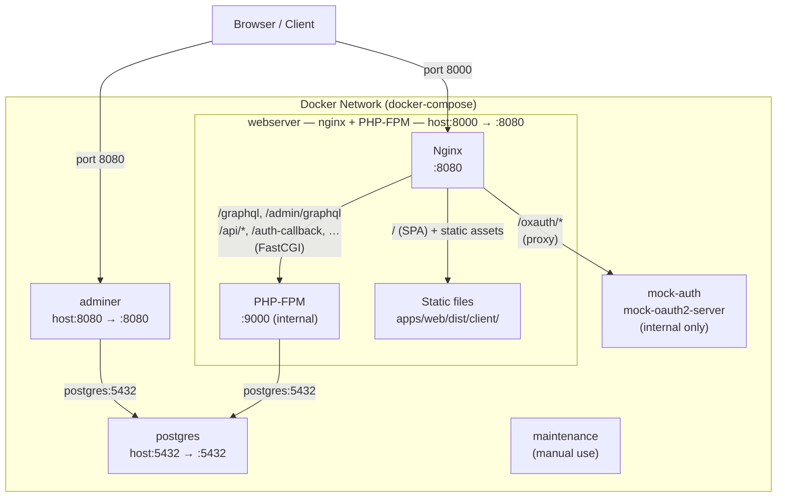
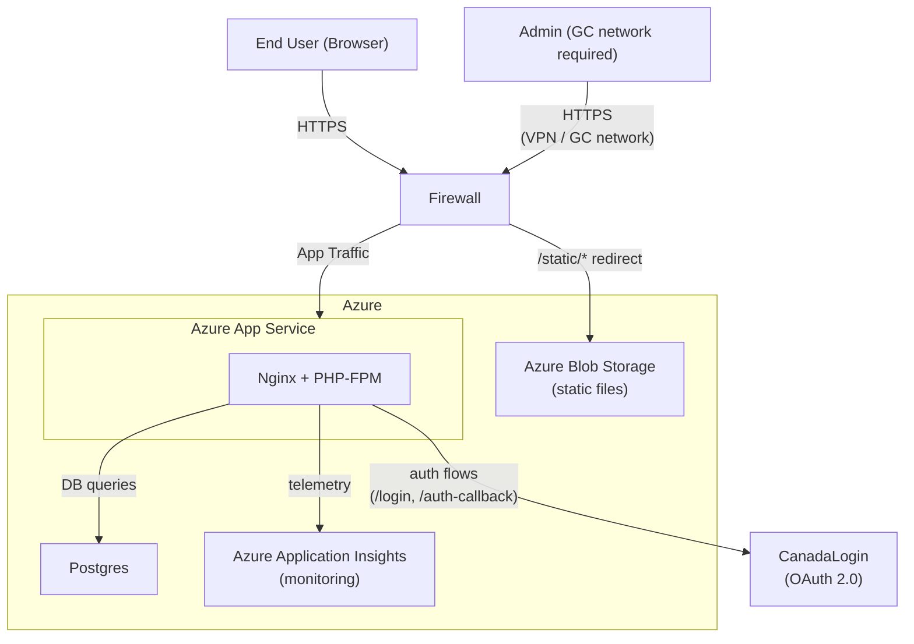

# Architecture

## Docker Compose (local development)

The local development environment is defined in [`docker-compose.yml`](../docker-compose.yml).

### Services

| Service | Image / Build | Host port | Notes |
|---|---|---|---|
| `webserver` | [`infrastructure/webserver.Dockerfile`](../infrastructure/webserver.Dockerfile) | `8000` | Runs nginx + PHP-FPM in a single container |
| `postgres` | `postgres` | `5432` | Primary relational database |
| `adminer` | `adminer` | `8080` | Web-based database UI |
| `mock-auth` | `ghcr.io/navikt/mock-oauth2-server` | none (internal) | OAuth2 mock server, proxied by nginx at `/oxauth/*` |
| `maintenance` | [`infrastructure/maintenance-container`](../infrastructure/maintenance-container) | none | Manual-use utility container; replicas set to 0 by default |

### Request routing

Inside the `webserver` container, nginx listens on port `8080` (mapped to host port `8000`) and routes requests as follows:

| Path pattern | Routed to |
|---|---|
| `/oxauth/*` | Proxy → `mock-auth:8080` |
| `/graphql`, `/admin/graphql` | FastCGI → PHP-FPM `:9000` |
| `/api/*`, `/login`, `/register`, `/auth-callback`, `/refresh`, `/sector-identifier` | FastCGI → PHP-FPM `:9000` |
| Static asset extensions (`.png`, `.js`, `.css`, …) | File system → `apps/web/dist/client/` |
| `/` (all other paths) | SPA fallback → `apps/web/dist/client/index.html` |

## Azure (production deployment)

- The application is built as a zip artifact via [Azure Pipelines](../infrastructure/azure-pipelines.yml) and deployed to an Azure App Service (PaaS).
- Static documents and tc-report files are served from Azure Blob Storage.
- The `/admin` routes are restricted to users on the Government of Canada network.

