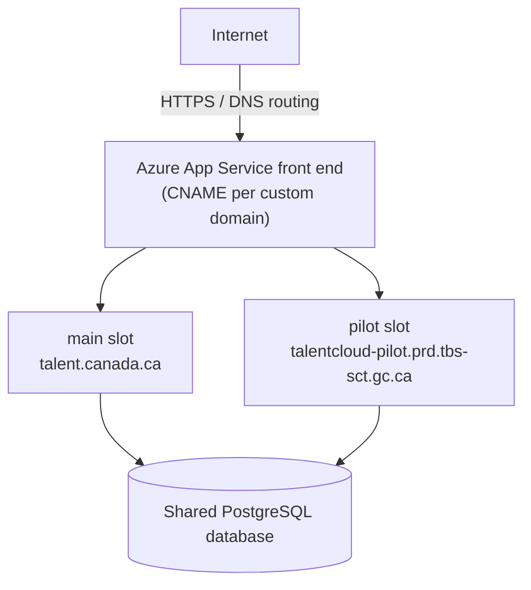

# Deployment slots (Azure App Service)

Reference for how production deployment slots are configured and operated, and how to add a new
slot for a phased rollout. The motivating example throughout is the Canada Login (CL) migration,
which used a `main` and a `pilot` slot to onboard users in groups before opening CL to the general
public. For the story of that migration — what broke, what was learned — see
[canada-login-migration-retro.md](canada-login-migration-retro.md).

## Overview

- Two slots run side by side on one Azure App Service: `main` (general public) and `pilot`
  (phased onboarding of a smaller group).
- **Not blue-green** — both slots share one PostgreSQL database. There is no independent data
  layer per slot.
- **Not a slot swap** — each slot is an independent deployment target with its own step in the
  CI/CD pipeline. Azure's slot-swap feature (atomically exchanging a staging and production slot)
  is not used here.
- Users reach a slot by domain, not by traffic splitting: `talent.canada.ca` → main slot,
  `https://talentcloud-pilot.prd.tbs-sct.gc.ca/` → pilot slot.



A user authenticated through either slot resolves to the same database record — same roles, same
profile, same history — because both slots point at the same database.

## Slot configuration

Each slot has its own App Settings in the Azure Portal. Settings that must differ per slot are
marked **Deployment slot setting** (a checkbox in the Portal); everything else inherits from the
parent App Service and is shared across slots.

| Variable | What it controls | Scope |
|---|---|---|
| `APP_URL` | Laravel app URL — must match the slot's custom domain exactly, no trailing slash. A trailing slash bakes into the config cache and produces double-slash redirects. | slot-specific |
| `OAUTH_CLIENT_ID` | OAuth client ID for this slot, validated against the `aud` claim in every incoming JWT. Must differ between slots when each slot has its own OAuth client. | slot-specific |
| `OAUTH_CLIENT_SECRET` | Client secret for this slot's OAuth registration. Separate credential, separate rotation cycle. | slot-specific |
| `OAUTH_REDIRECT_URI` | OAuth callback URL — must match a redirect URI registered with the identity provider for this client. Both `/en/auth/callback` and `/fr/auth/callback` should be registered. | slot-specific |
| `DEPLOYMENT_SLOT_NAME` | Used as the Laravel queue name for this slot's workers. Must be unique per slot — see [Shared infrastructure isolation](#shared-infrastructure-isolation) below. | slot-specific |
| `SLACK_WEBHOOK_URI` | Passed to `post_deployment.sh` as `$1`. Receives step-by-step deployment status. | shared |
| `DATABASE_URL` | PostgreSQL connection string. Both slots share one database — changes made in either slot's deployment affect both immediately. | shared |
| `OAUTH_DISCOVERY_URI` | OIDC discovery endpoint. Same across slots in the same identity provider environment (UAT or production). | shared |

## Post-deployment lifecycle

[`infrastructure/bin/post_deployment.sh`](../infrastructure/bin/post_deployment.sh) runs as the
startup command on every deployment to every slot. Steps are sequential and idempotent —
re-running on an already-deployed slot is safe. Each step's outcome is reported to Slack.

1. **Remove stale nginx apt source** — deletes `/etc/apt/sources.list.d/nginx.list`, a bad file
   shipped in the base image that breaks `apt-get update`. Can be removed from the script once the
   base image is fixed.
2. **Configure PHP CLI memory limit** — writes `memory_limit=256M` to a drop-in config file by
   overwrite (not append), so re-runs don't accumulate duplicate directives.
3. **Install runtime packages** — `supervisor`, `cron`, `postgresql-client` via apt. Absent from
   the base image; required for queue workers, the scheduler, and DB connectivity.
4. **Laravel optimize** — creates storage directories, sets permissions, prints the Lighthouse
   GraphQL schema, then runs `php artisan optimize` to compile the config, route, and view caches.
   The config cache bakes env vars at this moment: if `APP_URL` has a trailing slash in App
   Settings when this runs, it's baked into the cache and produces double-slash redirects
   throughout the app. Fix the App Setting first, then run
   `php artisan config:clear && php artisan optimize` in the slot's SSH session.
5. **Database migrations** — `php artisan migrate --force --no-interaction` against the shared
   PostgreSQL database. Output is captured and forwarded to Slack (capped at 2,500 characters).
   Because both slots share the DB, migrations run here affect live traffic on both slots
   immediately.
6. **RolePermission seeder** — syncs role and permission records to match the current codebase.
   Safe to re-run — upserts, does not delete user role assignments.
7. **Laravel Scheduler cron** — writes (overwrites) `/etc/cron.d/gc-digital-talent`, running
   `php artisan schedule:run` every minute as `www-data`.
8. **Supervisor setup** — runs `setup_supervisor.sh`, registering Laravel Horizon (queue workers)
   and Reverb (WebSockets) under supervisord, then starts the supervisor daemon.
9. **nginx config reload** — substitutes `$NGINX_PORT`, `$ROBOTS_FILENAME`, and
   `$HTTP_DISGUISED_HOST` into the nginx config via `substitute_file.sh`, then reloads nginx. The
   CSP nonce placeholder (`**CSP_NONCE**`), injected by Vite at build time, is handled separately
   by an nginx `sub_filter` at request-serve time.
10. **Frontend env substitution** — runs `substitute_file.sh` on
    `apps/web/dist/client/index.html` with no variable list, replacing all environment variable
    placeholders with their live values. This is how `APP_URL`, `OAUTH_CLIENT_ID`, and other
    client-visible config reach the SPA without a frontend rebuild per environment.

## Shared identity requirements

Because both slots read from the same database, the user record is the join point between them.
Whatever identity provider is used, it must return the **same `sub` identifier** for a given
person regardless of which OAuth client (i.e. which slot) they authenticated through:

| Requirement | Failure mode if missing |
|---|---|
| Shared (public) subject type, not pairwise | If the provider returns a different `sub` per client, a user logging in through one slot creates a separate database row from their other-slot record, with no role assignments — they appear unauthorized even after a successful login. |
| JWT access tokens | `isTokenProbablyExpired.ts` calls `jwtDecode()` on every access token. Opaque tokens aren't valid JWTs — the decode throws, the frontend treats the token as expired, and no `Authorization` header is sent. |
| Matching `OAUTH_CLIENT_ID` | `CanadaLoginBearerTokenService::validateAndGetClaims()` validates the JWT `aud` claim against this App Setting. A mismatch rejects every JWT — the user is authenticated at the provider but unauthorized in the app. |
| Registered redirect URIs | Both `/en/auth/callback` and `/fr/auth/callback` on the slot's domain must be registered with the provider, or the OAuth flow fails before the app is involved. |

Request the shared/public subject type and JWT token format explicitly whenever registering a new
OAuth client for a slot.

## Shared infrastructure isolation

Slots share some resources (database, queue backend) but not others (local filesystem). For any
resource shared between slots, ask: *can a request or job from one slot be processed or served by
the other, and would that be incorrect?* If yes, that resource needs slot-level isolation.

| Shared resource | Risk if not isolated | Isolation strategy |
|---|---|---|
| Queue backend (Redis / DB) | Workers on either slot race to pick up every job. Each slot has its own local filesystem, so a job that writes a file on one slot is invisible to the other. | `DEPLOYMENT_SLOT_NAME` as the Laravel queue name, unique per slot. Workers only consume their own slot's queue. |
| Database | A user logging in through a different slot creates a separate record if their `sub` differs — mismatched identity, missing roles. | Shared/public subject type at the identity provider — same `sub` across all clients. No DB-level change needed once the provider is configured correctly. |
| Redis cache | One slot caches a response that the other slot serves — stale or wrong-version data returned to users. | Cache key prefix per slot: `CACHE_PREFIX={DEPLOYMENT_SLOT_NAME}` in Laravel config. |
| Blob / file storage | Generated files (exports, uploads) written by one slot are readable by the other — version conflicts, overwritten outputs. | Storage path prefix or container per slot using `DEPLOYMENT_SLOT_NAME`. |
| Session store | A session created on one slot is resumed on another — auth state mismatch, unexpected logouts. | If sessions are in Redis, apply the same key-prefix strategy as cache. Or use database sessions (already isolated by the shared-DB design). |

## Replication playbook

Steps for adding a new slot for a phased rollout on an existing Azure App Service.

1. **Create the App Service slot.** Azure Portal: App Service → Deployment slots → Add slot. Select
   *Do not clone settings* — configure independently to avoid inheriting the wrong OAuth values.

   ```bash
   az webapp deployment slot create \
       --name <app-service-name> \
       --resource-group <rg-name> \
       --slot <new-slot-name>
   ```

2. **Configure slot-specific App Settings.** Portal → `<new-slot-name>` → Configuration →
   Application settings. Add these and tick **Deployment slot setting** on each:

   ```
   APP_URL             = https://<new-slot-custom-domain>
   OAUTH_CLIENT_ID     = <new-slot-client-id>
   OAUTH_CLIENT_SECRET = <new-slot-client-secret>
   OAUTH_REDIRECT_URI  = https://<new-slot-custom-domain>/auth/callback
   DEPLOYMENT_SLOT_NAME = <new-slot-name>
   ```

   Everything else — database URL, mail config, OAuth discovery URI — should *not* be marked
   slot-specific. They inherit from the parent App Service and stay shared across slots.

3. **Set the startup command.** Portal → `<new-slot-name>` → Configuration → General settings →
   Startup Command:

   ```
   post_deployment.sh $(SLACK_WEBHOOK_URI)
   ```

   The script ships in the deployment artifact at `infrastructure/bin/post_deployment.sh`. Azure
   passes this to the container init process on every deployment and restart.

4. **Register an OAuth client for the new slot.** Because slots share one database, a user must
   resolve to the same record regardless of which slot they log in through. Request from the
   identity provider:
   - Subject type: **public/shared** — same `sub` across all clients for your organization, not
     pairwise. Mandatory for the shared-DB architecture to work correctly.
   - Access token format: **JWT** (not opaque/reference tokens).
   - Redirect URIs: `https://<new-slot-domain>/en/auth/callback` and `/fr/auth/callback`.
   - Scopes: same as the organization's main production client.

5. **Add the custom domain and TLS.** Add the new domain as a custom hostname on the slot. Add a
   CNAME from the subdomain to the slot's default Azure hostname
   (`<app>-<new-slot-name>.azurewebsites.net`). Bind TLS — an App Service Managed Certificate works
   for non-production slots.

6. **Deploy the artifact to the new slot.** In the Azure DevOps pipeline, add a deployment step
   targeting the slot by name. The build artifact is the same zip produced by the existing
   pipeline — no separate build needed.

   ```yaml
   - task: AzureWebApp@1
     displayName: 'Deploy to <new-slot-name>'
     inputs:
       azureSubscription: '$(AZURE_SUBSCRIPTION)'
       appType: webAppLinux
       appName: '<your-app-service-name>'
       deployToSlotOrASE: true
       resourceGroupName: '$(RESOURCE_GROUP)'
       slotName: '<new-slot-name>'
       package: '$(Pipeline.Workspace)/gcDigitalTalent/*.zip'
       startUpCommand: 'post_deployment.sh $(SLACK_WEBHOOK_URI)'
   ```

7. **Verify the deployment.** SSH into the new slot and confirm post-deployment completed
   cleanly:

   ```bash
   # Confirm APP_URL has no trailing slash in config cache
   cd /home/site/wwwroot/api && php artisan config:show app | grep url

   # Confirm nginx is serving
   curl -sk https://localhost:8080/ | head -3

   # Confirm the OAuth client ID in the config cache
   php artisan config:show services | grep oauth
   ```

   If login redirects to `//en/applicant` (double slash), the config cache has a trailing slash in
   `APP_URL`. Fix the App Setting, then SSH in and run
   `php artisan config:clear && php artisan optimize`.

## Deployment model: phased migration

Each slot is an independent deployment target with its own CI/CD pipeline step. There is no slot
swap. Users aren't randomly split — they're deliberately onboarded group by group through a
separate domain until the migration is validated.

| | This architecture | True blue-green |
|---|---|---|
| Database | Both slots share one PostgreSQL database. A schema migration deployed to either slot affects both immediately. No isolation at the data layer. | Each environment has its own independent database. Green can run a different schema version from blue without affecting live data. |
| Code versions | Both slots run the same codebase. Deploying a new version to one slot makes it query the same shared database as the other — incompatible schema changes would break the other slot immediately. | Blue and green can run entirely different application versions, including schema-incompatible changes. Rollback reverts both code and data layer. |
| Traffic routing | Users are deliberately directed to a slot by domain. No automatic traffic split or atomic cut-over. | Traffic is atomically switched from blue to green. Rollback is a second atomic switch. |
| Rollback | Rolling back requires a redeployment. Database migrations applied during deployment aren't reverted — they must be backward-compatible. | Rollback is instant — switch traffic back to blue, whose database is still in the pre-migration state. |

This model is the right choice when the goal is validating a change (e.g. a new identity
provider) with a real but controlled user group, not running two different application versions
simultaneously. A separate database per slot would complicate shared user identity (the `sub`
consistency requirement above) without adding any benefit — one database means one source of
truth.

**Schema migration constraint:** because both slots share the database, any migration deployed to
either slot takes effect immediately for both. Migrations must be backward-compatible with the
code currently running on the other slot — use the expand-contract pattern: add a new column
before removing the old one, never drop a column in the same deployment that stops writing to it.
