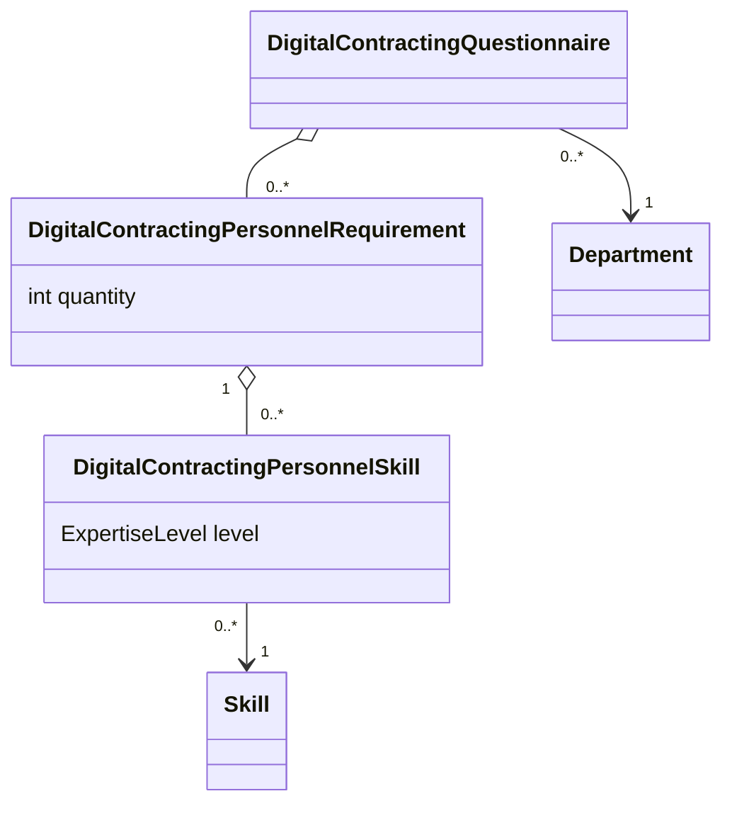

# Background

We are preparing to load directive forms to the database. Information about the forms is available at https://talent.canada.ca/en/directive-on-digital-talent.

# Forms

There are several forms in the Directive Forms group.

## Digital Contracting Questionnaire

The first form is the Digital Contracting Questionnaire. It primarily consists of data in the DigitalContractingQuestionnaire entity but could have multiple personnel requirements. Each personnel requirement could additionally have several associated skill requirements.

