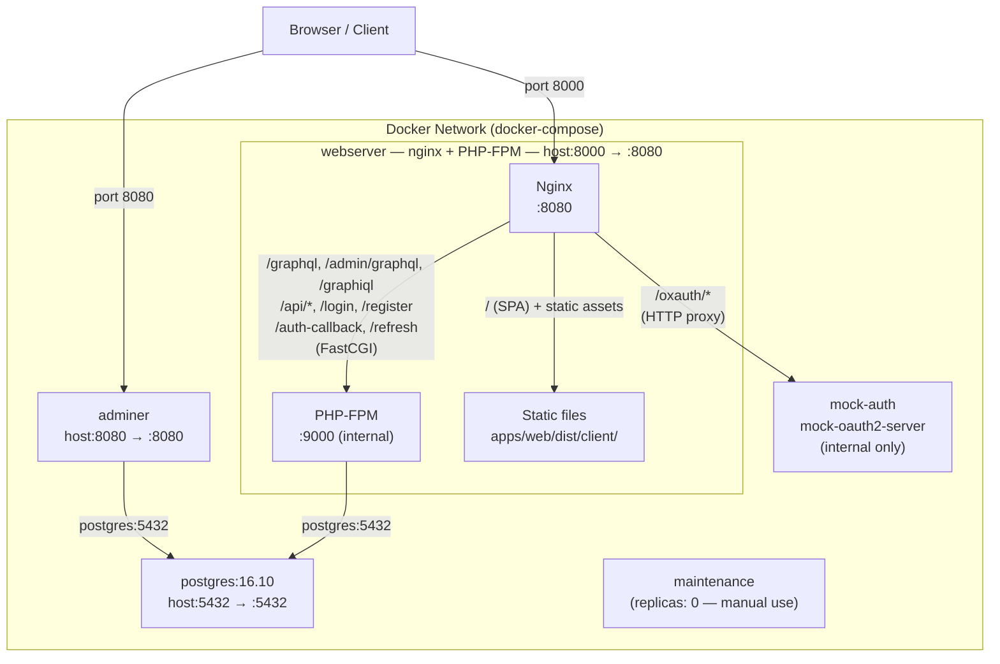

# Docker Compose Architecture

This document describes the local development environment defined in [`docker-compose.yml`](../docker-compose.yml). It includes a diagram of the original layout as well as a corrected, accurate diagram.

## Services

| Service | Image / Build | Host port → Container port | Notes |
|---|---|---|---|
| `webserver` | Custom Dockerfile (`infrastructure/webserver.Dockerfile`) | `8000 → 8080` | Runs nginx + PHP-FPM in a single container |
| `postgres` | `postgres:16.10` | `5432 → 5432` | Primary relational database |
| `adminer` | `adminer` | `8080 → 8080` | Web-based database UI |
| `mock-auth` | `ghcr.io/navikt/mock-oauth2-server:2.1.5` | none (internal only) | OAuth2 mock server, accessed via nginx proxy at `/oxauth/*` |
| `maintenance` | Custom Dockerfile (`infrastructure/maintenance-container`) | none | Manual-use utility container; replicas set to 0 by default |

## Request routing inside `webserver`

nginx listens on port `8080` inside the container (mapped to `8000` on the host) and routes requests as follows:

| Path pattern | Routed to |
|---|---|
| `/oxauth/*` | HTTP proxy → `mock-auth:8080` |
| `/graphql`, `/admin/graphql`, `/graphiql`, `/admin/graphiql` | FastCGI → PHP-FPM `:9000` |
| `/api/*`, `/login`, `/register`, `/auth-callback`, `/refresh`, `/sector-identifier` | FastCGI → PHP-FPM `:9000` |
| Static asset file extensions (`.png`, `.js`, `.css`, etc.) | File system → `apps/web/dist/client/` |
| `/` (all other paths) | SPA fallback → `apps/web/dist/client/index.html` |

PHP-FPM connects to the `postgres` service directly on port `5432`.

## Original diagram

The following is the original diagram that was generated from the codebase. It has layout issues: the static files volume is shown outside the Docker network boundary, intermediate routing nodes create crossing lines, and subgraph labels are truncated.

## Corrected diagram

The corrected diagram below accurately reflects the architecture:

- Static files (`apps/web/dist/client/`) are shown **inside** the `webserver` container, since they are served from a volume mount within that container.
- Route patterns are expressed as edge labels rather than intermediate nodes, eliminating crossing lines.
- All containers are shown inside the Docker network boundary.

