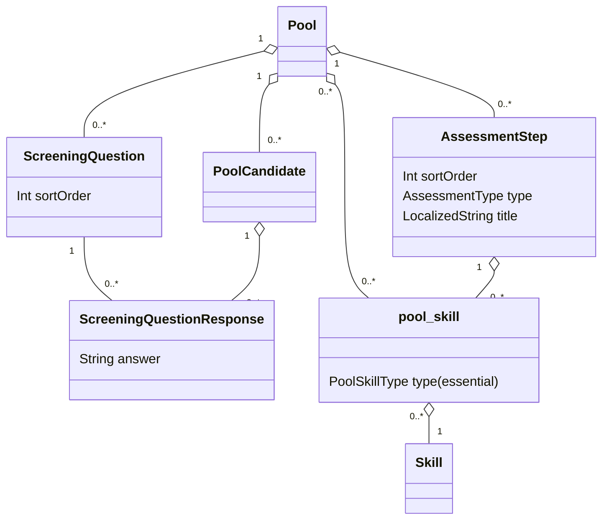

# Background

A mermaid markup to represent the pool model along with all its associated relations.

## Pool model

```mermaid
classDiagram

class Pool { }

class AssessmentStep {
    Int sortOrder
    AssessmentType type
    LocalizedString title
}

class ScreeningQuestion {
    Int sortOrder
}

class ScreeningQuestionResponse {
    String answer
}

class PoolCandidate

class pool_skill {
    PoolSkillType type (essential)
}


Pool "1" o-- "0..*" AssessmentStep
Pool "1" o-- "0..*" ScreeningQuestion
ScreeningQuestion "1" -- "0..*" ScreeningQuestionResponse
PoolCandidate "1" o-- "0..*" ScreeningQuestionResponse
Pool "1" o-- "0..*" PoolCandidate
Pool "0..*" o-- "0..*" pool_skill
AssessmentStep "1" o-- "0..*" pool_skill
pool_skill "0..*" o-- "1" Skill
```
